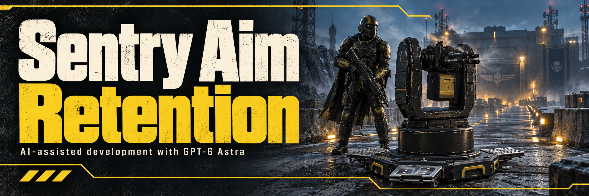

> Release for Steam build 25480438 / EXE 1.8.46015.0. Offline checks passed; ran in live play. Requires Bingus Shared Loader v18 or newer (v19 is current).

Performance and resilience update v1.1.0: keeps each sentry's memory layout instead of locating it on every check, checks an idle sentry once per frame, and pauses instead of stopping after errors. Measured in live play: 0.020 ms per frame in missions with a sentry deployed (0.178 before) and 0.012 on the ship.

# Sentry Aim Retention

Aims to keep autonomous sentries facing their last tracked target after losing it, instead of turning back toward the Helldiver while their burst may still be firing.

- **Hold through target loss.** Retains the last sampled aim and pauses rotation as soon as the previous target disappears, without waiting for the firing state to finish.
- **Resume tracking and scanning.** Releases the hold when a replacement target appears or a scanning transition is detected.
- **Find the next target sooner.** After losing a target while firing, Gatling and machine-gun sentries request another native target search without waiting out the usual one-second selection timer. Target choice remains with the game's AI.
- **Pause broad firing sweeps.** Gatling and machine-gun sentries can keep firing through small adjustments and nearby target changes, but pause shots during broad or prolonged turns and resume near the target. After a target-loss pause, a close replacement with a clear path can resume immediately. Their trigger and spin-up timer stay intact during the pause.
- **Stop wasted ground fire.** Gatling and machine-gun sentries pause shots when their target is lost, their aim still belongs to a previous target, or solid terrain blocks the current target point. Low, exposed targets remain eligible; firing resumes when the path clears and aim settles. Destructible cover, including fences in that collision class, keeps normal penetration and destruction behavior.

Aim retention applies to locally controlled Gatling, machine gun, laser cannon, rocket, flamethrower, mortar and EMS mortar sentries. Selective firing pauses apply to Gatling and machine-gun sentries.

Release **v1.1.0** lowers the per-check cost and adds the shared runtime's error handling. Aim holds and releases were confirmed live on earlier releases; this build ran in real play on 2026-10-04 with 13 aim holds and no errors. Multiplayer authority transitions and the visible barrel pose during a hold remain unverified in game. Routine diagnostics are off by default; developers can set `CowboyBingusDiagnostics = true` before initialization to enable them.

Current version: **v1.1.0**, for game build **25480438**. See [changes](CHANGELOG.md) and [validation coverage](docs/MIGRATION_VALIDATION.md).

**AI disclosure:** Claude Opus 5.5 assisted with research, implementation, tests and documentation.

## License

Zero-Clause BSD (0BSD): use, copy, modify and distribute for any purpose, with no conditions. See `LICENSE`.
